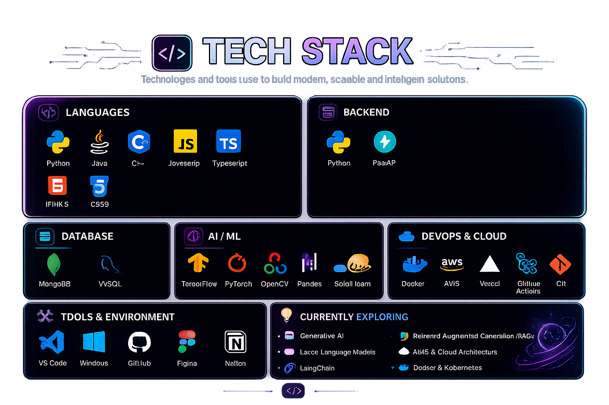

<!-- ========================================================= -->
<!--                     A U R O R A  v2.0                     -->
<!--            Designed for Janmeet Singh                     -->
<!-- ========================================================= -->

<div align="center">


</div>

---

<div align="center">

# 👋 Hello, I'm **Janmeet Singh**

### Robotics & AI Engineer • Data Science • Machine Learning Enthusiast • Data Analysis


</div>

---

<div align="center">

> **"Turning ideas into intelligent software, one commit at a time."**

</div>

<br>
<!-- ========================================================= -->
<!--                 SOCIAL DASHBOARD                          -->
<!-- ========================================================= -->

<div align="center">

<a href="https://www.linkedin.com/in/janmeet/">

</a>

<a href="https://itsjanny.vercel.app/">

</a>

<a href="mailto:janmeetsingh527@gmail.com">

</a>

<a href="https://github.com/itsjanny">

</a>

<a href="https://github.com/itsjanny">

</a>

<a href="https://leetcode.com/u/itsjanny/">

</a>

</div>

<br>

<div align="center">

### 🌐 Connect With Me

| Portfolio | LinkedIn | GitHub | Email | LeetCode |
|:----------:|:--------:|:------:|:------:|:--------:|
| 🌍 **Live Website** | 💼 **Professional Network** | 💻 **Open Source** | 📬 **Let's Connect** | 🧩 **Problem Solving** |

</div>

---

<div align="center">

## ⚡ Quick Facts

| 🚀 Focus | 💡 Interests | 🌱 Currently Learning | 🎯 Goal |
|-----------|--------------|----------------------|----------|
| AI • ML • Robotics | Full Stack Development | LLMs • RAG • Cloud | Build impactful AI products |

</div>

<br>

<div align="center">


</div>
<!-- ========================================================= -->
<!--                     ABOUT ME                              -->
<!-- ========================================================= -->

<h2 align="center">💻 About Me</h2>

<div align="center">
# 👋 Hi, I'm Janmeet Singh

<!-- Hero Banner -->
<p align="center">
  
</p>

<!-- Typing Animation -->
<p align="center">
  
</p>
</div>

<br>

---

## 💻 About Me
````markdown
>>> python about.py

👋 Hi, I'm Janmeet Singh

✓ Robotics & AI Engineer
✓ Full Stack Developer
✓ Machine Learning Enthusiast
✓ Open Source Contributor

Loading skills...
████████████████████ 100%

Status: Ready to build something amazing 🚀
````

##  Tech Stack

<p align="center">
  
</p>

<div align="center">

*Technologies and tools I use to build modern, scalable, and intelligent software.*

</div>

---

---


</div>

<br>

<table align="center">
<tr>
<td width="50%">

### 🚀 Currently

- 🤖 Building AI-powered applications
- 🌐 Developing modern Full Stack projects
- 🧠 Solving Data Structures & Algorithms
- 📚 Exploring LLMs, RAG & Generative AI
- ☁️ Learning Cloud & DevOps
- 💙 Contributing to Open Source

</td>

<td width="50%">

### 🎯 2026 Goals

- ⭐ Solve **500+ LeetCode problems**
- 🚀 Build production-ready AI products
- 🌍 Make meaningful Open Source contributions
- 📖 Master System Design fundamentals
- 💼 Secure an AI / Software Engineering role
- ⚡ Keep learning every single day

</td>
</tr>
</table>

---

## 🌟 A Little More About Me

```yaml
Name: Janmeet Singh

Located In: India

Education:
  - B.Tech in Robotics & Artificial Intelligence

Current Focus:
  - Artificial Intelligence
  - Machine Learning
  - Data Science
  - Open Source

Interests:
  - Robotics
  - Generative AI
  - Cloud Computing
  - Computer Vision
  - Software Engineering

Currently Learning:
  - LangChain
  - RAG
  - Vector Databases
  - Docker
  - AWS

Open To:
  - Software Engineering Internships
  - AI / ML Internships
  - Open Source Collaboration
```

---

<div align="center">

### 💡 Philosophy

> **"Code is more than instructions—it's a way to turn ideas into impact."**

</div>

<br>

<div align="center">


</div>
